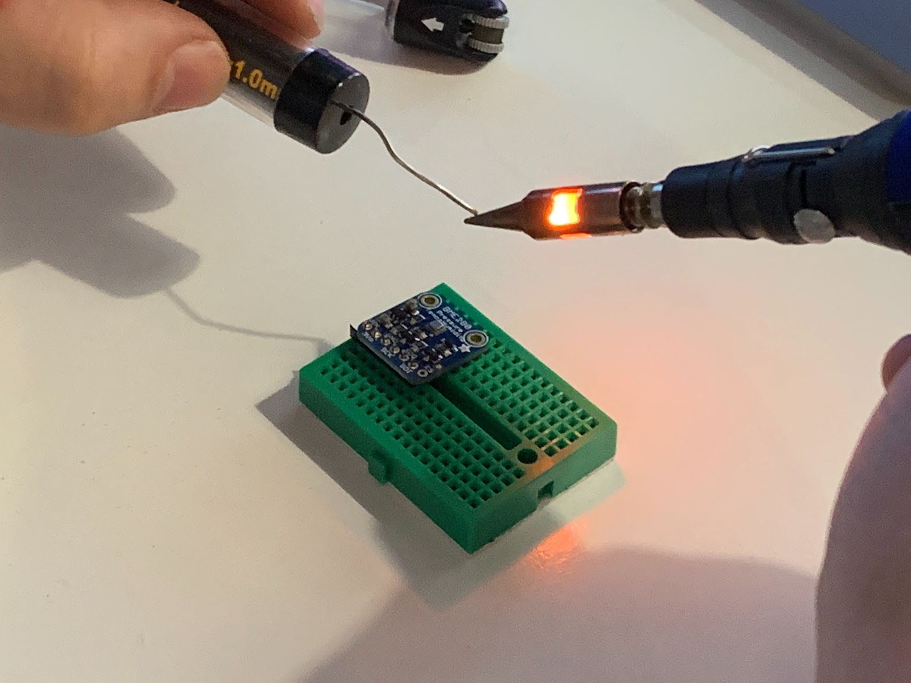

# Raspberry Pi Weather Station
A weather station that gets raw data from a sensors connected with Raspberry Pi and stores that information and can be accessed by user.

## Repositories
1. [A python app reading data from a weather sensor on a Raspberry Pi and sending it to a web API](https://github.com/Hives/weather-station-rpi)
2. [A Node/Express web server receiving data from the Raspberry Pi, storing it in a Mongo database, and making it available via API](https://github.com/riyadattani/weather_station_server)
3. [A JavaScript single-page web app collecting weather data from the server and a 3rd party API and presenting it in graph form](https://github.com/hybridbad/spa-weather-station-vanilla)

## SPA
Check the weather station [Single Page App](https://hybridbad.github.io/spa-weather-station-vanilla/).

## Project Work

- We used [trello board](https://trello.com/b/vbV1s9Rp/placeholder) as form of Kanban for this project. 
- We [presented](https://docs.google.com/presentation/d/1YhNafnm0zdnipqh3UDPu5Sn-wXPZohDw85Wv1GgQ7ZY/edit?usp=sharing) this project at the end of the course on Demo Day.
- Our learning documentation is available on [Wiki](https://github.com/Hives/makers-weather-station/wiki).

## Tech Stack
- Python
- Pytest
- Raspberry Pi
- Javascript
- ESLint
- Express
- MongoDB
- Node.js
- Heroku
- Travis CI/CD

## Tests
Offers multiple tests to fulfil user requirements.

## Motivation
- build something with hardware
- learn new tech stack
- test-drive the code
- follow agile process
- write code that is easy to change
